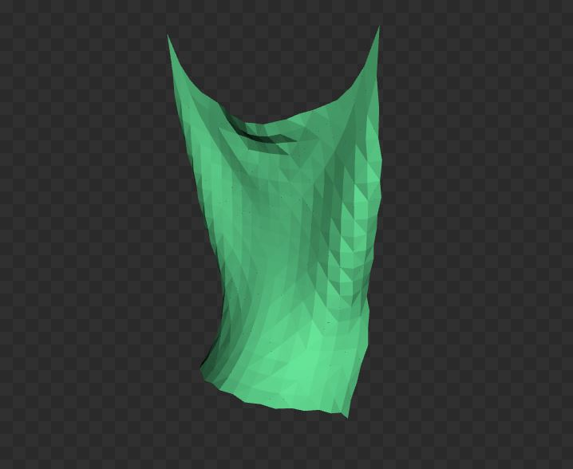
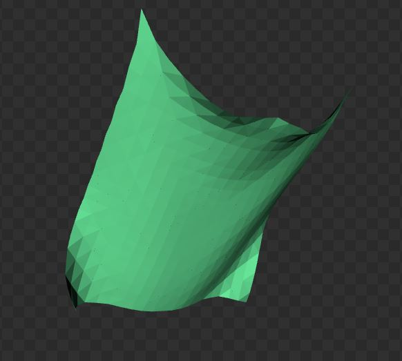
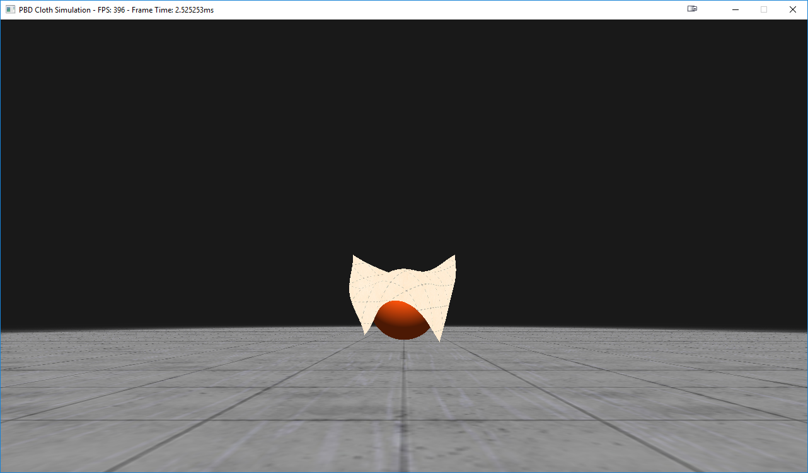
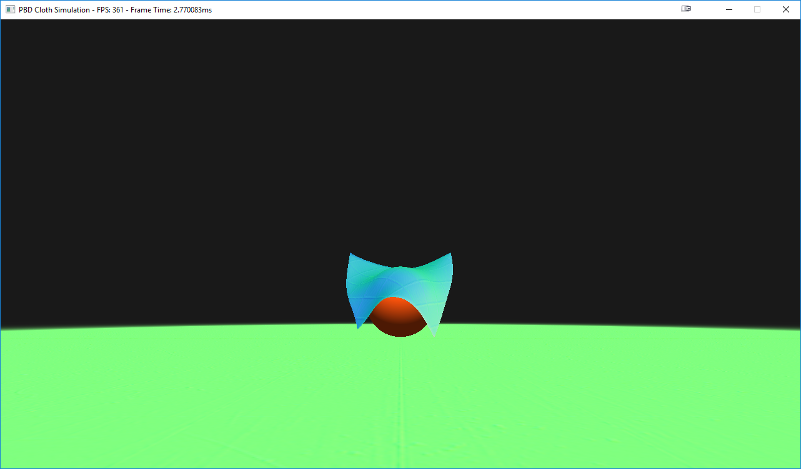
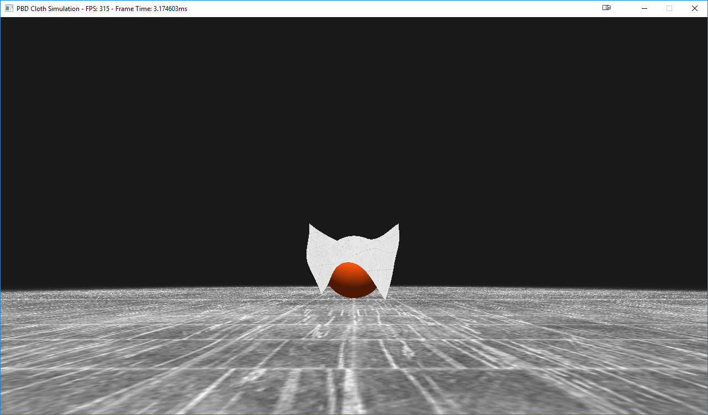
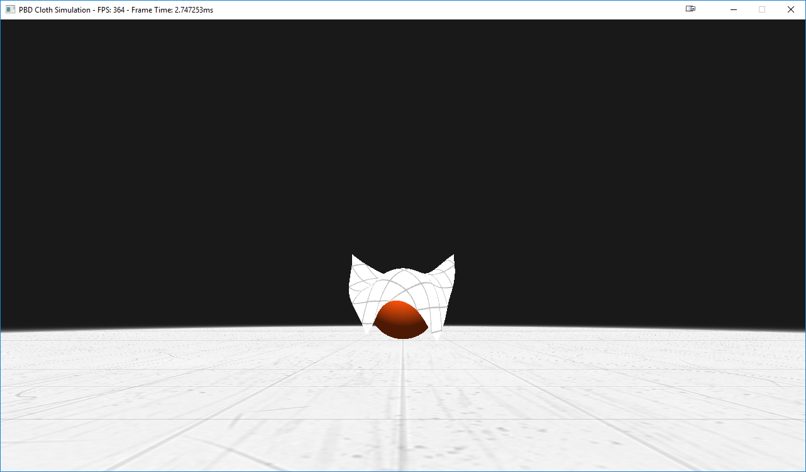
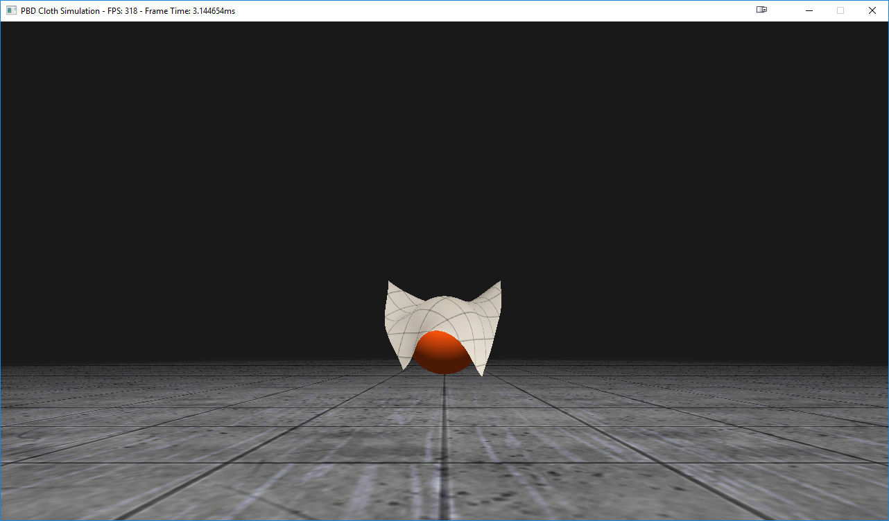

Flamenco
=========

### Description

Flamenco is a GPU position-based dynamics (PBD) cloth simulation sufficiently fast and robust for use in games. Our take on this well-studied problem is an amalgam of some of the industry's best PBD cloth methods, some dating back as far as 2003, some recently communicated in GDC 2018, all mixed and ported to the GPU. By parallelizing these methods on the GPU, we achieve frame rates far higher than their CPU-based counterparts, and easily satisfy the game industry's 60 fps standard.

.gif)

----------------

### Build Instructions and Links

This repository is a placeholder for the Project. You can track this progress by going to (any of the following links):

- [GPU Cloth Sim Issue Tracker: Issue #47](https://github.com/vasumahesh1/azura/issues/47)
- [CPU Cloth Sim Issue Tracker: Issue #46](https://github.com/vasumahesh1/azura/issues/46)

The issue tracker has screenshots reporting progress. All commits related to them are tagged as "Issue #XYZ" format.

This project builds online as we commit to it. The latest build can be run and is available at [Appveyor](https://ci.appveyor.com/project/vasumahesh1/azura/history). 

[](https://ci.appveyor.com/project/vasumahesh1/azura)

**Build #241:**
[Cloth Sim Executable Build #241 (http://bit.ly/azura_cloth_build_241)](http://bit.ly/azura_cloth_build_241)

If this link is old, you can try out the latest build on Azura and check for the `WIN64_RELEASE` tag and download the `3_ClothSim` zipped executable.

[Latest Azura Build](https://ci.appveyor.com/project/vasumahesh1/azura)

These links will download all the necessary config / logging / shaders / textures etc. to run the application, all as one zip. Also, these executables are running at 120 FPS, so your VSync must be off. We were able to achieve around 480 FPS as well, but we locked it at 120 FPS such that older hardware can run them as well with the same weights / configs needed for the simulation.

----------------

### Methodology

#### PBD Algorithm

We write the core PBD algorithm here for convenience:

```
ALGORITHM Position Based Dyanmics:
  for all vertices i do
    initialize x_i, vi, wi = 1/mi 
  end for
  loop
    for all vertices i do vi = vi + wi * dt * f_ext
    for all vertices i do pi = xi + dt * vi
    for all vertices i do genCollConstraints(xi, pi)
    loop solverIterations times
      projectConstraints()
    end loop
    for all vertices i do
      vi = (pi - xi) / dt
      xi = pi
    end for
  end loop
END.
```

#### GPU-Based PBD Solver

The PBD algorithm is typically evaluated on the CPU using a Gauss-Seidel type solver, which works exclusively in a serial fashion. Porting the PBD algorithm therefore requires a different approach. Researchers typically choose one of two methods - A Jacobi iterative solver or a graph coloring algorithm. The graph coloring method identifies independent sets of vertices (those not linked by constraint functions) then solves the constraints associated with each of these sets in a serial fashion using the Gauss-Seidel method. While this method guarantees convergence, it limits vertex/constraint throughput on the GPU and is still inherently serial. The Jacobi method, on the other hand, maximizes parallelism but does not guarantee convergence without the following adjustment to the PBD algorithm: the change in position is computed for each vertex i for all constraints that apply to i in parallel. The final correction applied to i, however, is the average of these adjustments.

#### Geometric Constraints

Our cloth model includes four distinct geometric constraints intended to approximate real cloth behavior: distance, isometric bending, long-range attachments, and anchor constraints. We briefly describe each of these here.

##### Distance

The most primitive of geometric constraints, distance-based constraints restore mesh edges that extend or compress relative to their rest lengths.

##### Isometric Bending

The isometric bending constraint restores winged edges to their rest configurations, and is best used with inextensible cloth materials.

##### Anchors

We set the mass of vertices we wish to use as anchor points to infinity. Hence, anchor point weights w = 1 / m are zero, implying that anchor positions are unaffected by constraints.

##### Long-Range Attachments

We include this additional distance-based constraint because it helps enforce inextensibility when the cloth model includes anchors.

.gif)
*A Shower Curtain Using Anchors and Long-Range Attachments*

#### Environment Collisions

Environment collisions are currently restricted to SDF-based models for the sphere and plane. The self-collision method described below naturally extends to all point-triangle collisions that might occur in the scene, but SDFs simplify the evaluation of core cloth physics.

##### Sphere

Every vertex position is checked to make sure it is outside the radius of the sphere centered at some origin. If not, the vertex is pushed out in the direction parallel to the vector connecting the vertex's pre-projected position and the sphere's center.

##### Plane 

Every vertex position is checked to make sure it remains on the same side of the plane it was on in the previous time step. If not, the vertex is pushed back in the direction normal to the plane.

  
*Plane and Sphere SDF Cloth Collisions*

#### Mesh Definition

Mesh behavior is a function of the constraints applied to the mesh, and these in turn are a function of the mesh's topology. We observe behavioral differences depending on the choice of mesh discretization. We demonstrate two such discretization's below:

 

On the left, we've specified a topology that divides the mesh such that every interior vertex is defined by the joining of four or eight identical triangles that meet isotropically in x and y. This topology guarantees more symmetric behavior. On the other hand, most default meshes will be topologized as on the right. Here, we can see that vertices are defined by the joining of six triangles, but these are biased along a particular diagonal direction. This mesh topology satisfies distance-based constraints more easily, but is biased in its evaluation of bending constraints.

#### Spatial Hashing with Predictive Constraints for Self-Collisions

To implement naive self-collision constraint generation, every vertex must be checked against every triangle in the mesh. We accelerate this process by using an adaptive spatial hash grid to bin mesh vertices before constraint projection. We then compute the axis-aligned bounding box encapsulating each triangle and its projected displacement. Then, following Chris Lewin's prescription for predictive constraints (introduced at GDC 2018, see links below), we generate all self-collision constraints for the cloth. Predictive constraints guarantee that cloth vertices never pass through the mesh and are computationally expedient.

.gif)  
*Predictive Constraints Resolve Self-Collisions*

----------------

### Implementation

This project was written for an engine being developed by one of the authors (see links above). This engine builds to D3D12 and Vulkan for rendering, but for this particular project we restrict ourselves to the D3D12 build. To implement the above methodologies, we include the following shader passes:

#### Compute Vertex Projected Positions

After updating particle velocites with any external forces, we update vertex positions: pi = xi + dt * vi in parallel.

#### Binning Initialization

This pass empties each hash grid cell of all previously stored vertices.

#### Vertex Binning

Here, all cloth vertices are binned into their appropriate hash grid cells.

#### Generate Self-Collision Constraints

We calculate the axis-aligned bounding box encapsulating each triangle and its projected displaced location and check all hash grid cells this box intersects. We then compare the projected positions of vertices binned in these cells with the barycentric-interpolated time-projected position of this vertex's spatially-projected position on the triangle in consideration. If these predictive measurements indicate a collision, a predictive constraint is generated using a normal triangle-point collision constraint that is evaluated in the triangle-point pair's pre-projected frame.

#### Apply Vertex Constraints

Here, all constraints are evaluated in parallel, including the self-collision constraints generated in the previous step, distance constraints, long-range attachment constraints, and bending constraints.

#### Apply Deltas

We keep track of the total displacement of each vertex as well as the number of constraints that have affected each vertex. We then average these displacements by dividing by the number of constraints affecting each vertex. This is essential process in a Jacobi-style solver. Finally, we resolve all SDF environment collisions here.

#### Compute Vertex Positions

Vertex positions and velocities are updated in parallel here as per the PBD algorithm.

NOTE: Apply Vertex Constraints, Apply Deltas, and Compute Vertex Positions are repeated over multiple passes in sequence as per the iterative Jacobi-style parallel solver algorithm.

#### Mesh Normals

This shader computes mesh normals for lighting and normal maps.

#### Shading Pass

Finally, the mesh is rendered as per the D3D12 API.

#### Frame Timing Breakdown

[Graph]


----------------


### Performance

All timing studies were perfomed using the following software/hardware:

OS: Windows 10  
CPU: i7 4790K  
GPU: NVIDIA RTX 2080

#### CPU vs GPU 

Including basic distance and bending constraints, we managed CPU frame rates upwards of 20 FPS. For a cloth model of equal complexity, we observe frame rates upwards of 400 FPS.

#### Mesh Resolution vs Compute Time

[Graph]

#### Self-Collision Constraint Prediction vs Hash Cell Grid Resolution

[Graph]

----------------

### Additional Features

#### GLTF 2.0 Mesh Support

Flamenco currently supports GLTF 2.0 mesh loading. However, GLTF meshes do not currently work with cloth self-collisions turned on. We are currently working to enable this feature.

  
*Flamenco Supports GLTF 2.0 Mesh Loading*

Our Constraints also work on custom meshes. We also built a vertex aliasing technique that prevents duplicate vertices from being simulated by the core PBD algorithm.

|  |  |
| ---- | ---- |
| Distance Constraint = 0.9 | Distance Constraint = 0.6 |
| Bending Constraint = 0.6 | Bending Constraint = 0.1 |


#### Rendering Pipeline using PBR Shading

| Albedo   | Normals   | Roughness   | AO   |
|:-------------:|:-------------:|:-------------:|:-------------:|
|  |  |  |  |

| Final Frame |
|:----:|
|  |

#### Meme Generator

We've added a toggleable meme generator. Results are shown below.

.gif)

----------------

### References

1. Jan Bender, Matthias Müller, and Miles Macklin, [Position-Based Simulation Methods in Computer Graphics](http://mmacklin.com/EG2015PBD.pdf)
2. Chris Lewin, [Cloth Self-Collision with Predictive Contacts](https://media.contentapi.ea.com/content/dam/eacom/frostbite/files/gdc2018-chrislewin-clothselfcollisionwithpredictivecontacts.pdf)
3. Marco Fratarcangeli and Fabio Pellacini, [A GPU-Based Implementation of Position Based Dynamics for Interactive Deformable Bodies](http://publications.lib.chalmers.se/records/fulltext/219708/local_219708.pdf)
4. Matthias Müller, Bruno Heidelberger, Marcus Hennix, and John Ratcliff, [Position Based Dynamics](http://matthias-mueller-fischer.ch/publications/posBasedDyn.pdf)
5. Matthias Teschner, Bruno Heidelberger, Matthias Müller, Danat Pomeranets, and Markus Gross, [Optimized Spatial Hashing for Collision Detection of Deformable Objects](http://matthias-mueller-fischer.ch/publications/tetraederCollision.pdf)

### Made by:

* Vasu Mahesh
  * [LinkedIn](http://linkedin.com/in/vasumahesh)
  * [Code Blog](http://www.codeplaysleep.com)

* Zach Corse
  * [LinkedIn](https://www.linkedin.com/in/wzcorse/)
  * [Personal Website](https://wzcorse.com)
